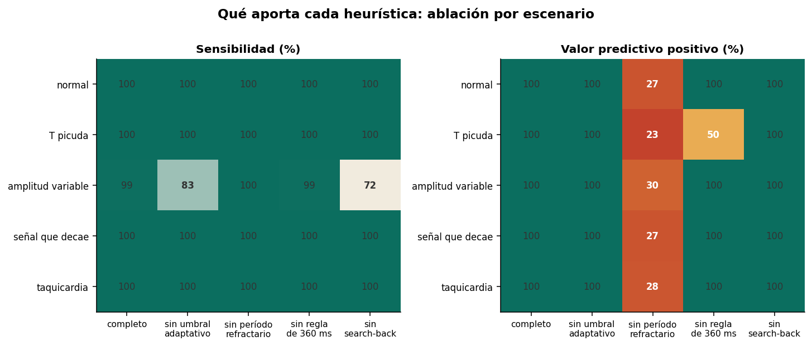
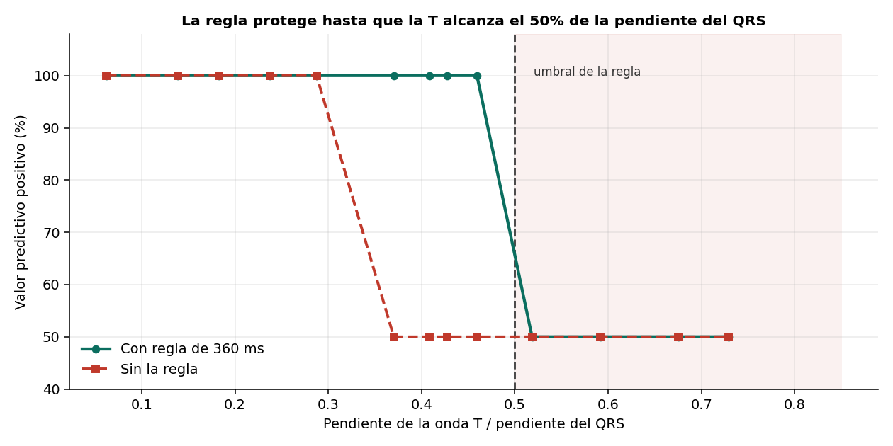
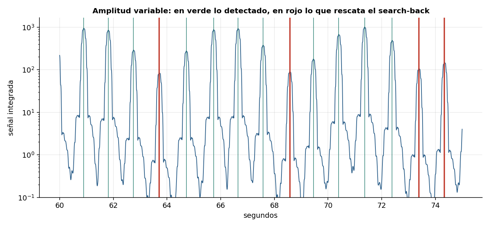

# Las heurísticas de Pan-Tompkins: qué aporta cada una

Implementación completa de la lógica de decisión de Pan-Tompkins (1985) con las cuatro
heurísticas conmutables, y ablación sistemática sobre cinco escenarios.



## Resultado principal

**El período refractario es la heurística crítica.** Sin él el valor predictivo positivo
cae al 23–30% en todos los escenarios, incluido el limpio: 502 falsos positivos sobre 187
latidos reales.

**Las otras tres son invisibles en señal normal** y cada una existe para un modo de fallo
concreto:

| Heurística | Escenario donde actúa | Efecto al quitarla |
|---|---|---|
| Período refractario | todos | VPP 100% → 27% |
| Regla de 360 ms | onda T picuda | VPP 100% → 50% |
| Umbral adaptativo | amplitud variable | Se 99.5% → 82.9% |
| Search-back | amplitud variable | Se 99.5% → 71.7% |

Esto explica por qué tantas implementaciones parciales parecen correctas: en un registro
limpio un detector sin heurísticas funciona igual de bien.

## Límite de la regla de 360 ms



La regla descarta un candidato si su pendiente es menor a la mitad de la del latido
anterior. El VPP cae exactamente cuando la razón de pendientes cruza 0.5 — el umbral que
la regla misma define. Pasado ese punto, un falso positivo por latido: la frecuencia
cardiaca reportada se duplica.

## Search-back



Heurística deliberadamente asimétrica: prefiere un falso positivo antes que perder un
latido. En un monitor cardiaco esa asimetría es la correcta.

## Dos detalles de implementación

**La pendiente se mide sobre la señal derivada, no sobre la integrada.** En el pico de la
integrada la pendiente vale cero por definición. Una primera versión de la regla de 360 ms
no hacía nada por este motivo.

**`find_peaks(distance=...)` ya es un período refractario.** Buscar candidatos con
distancia mínima impone la heurística aunque no se escriba. Para que la ablación sea
honesta, ese parámetro se desactiva junto con el bloqueo explícito.

## Contenido

```
notebooks/pan_tompkins_heuristicas.ipynb   Notebook completo, ejecutable de principio a fin
src/pantom.py                              Las cuatro transformaciones
src/detector.py                            Detector con heurísticas conmutables
src/escenarios.py                          Generación de los cinco escenarios
figuras/                                   Figuras generadas
```

## Reproducir

```bash
git clone https://github.com/USUARIO/pan-tompkins-heuristicas.git
cd pan-tompkins-heuristicas
pip install -r requirements.txt
jupyter lab notebooks/pan_tompkins_heuristicas.ipynb
```

No requiere descargar datos: las señales se generan dentro del notebook.

## Limitaciones

La señal es sintética y cada escenario estresa una heurística a la vez. Un registro real
presenta varios problemas simultáneos.

No hay arritmias. Extrasístoles, fibrilación auricular y pausas sinusales cambian el
juego: el search-back puede inventar un latido en una pausa real, y la regla de 360 ms
puede descartar una extrasístole legítima. Evaluar eso requiere registros anotados.

Los parámetros son los del artículo original, ajustados sobre MIT-BIH en 1985.

## Referencias

- Pan J., Tompkins W. *A Real-Time QRS Detection Algorithm.* IEEE Trans. Biomed. Eng., 1985.
- Hamilton P., Tompkins W. *Quantitative investigation of QRS detection rules using the MIT/BIH arrhythmia database.* IEEE Trans. Biomed. Eng., 1986.

## Licencia

MIT — ver [LICENSE](LICENSE).
